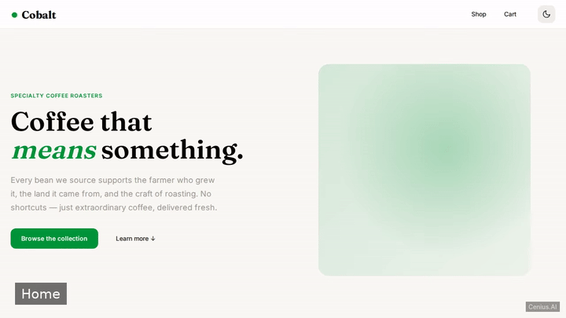
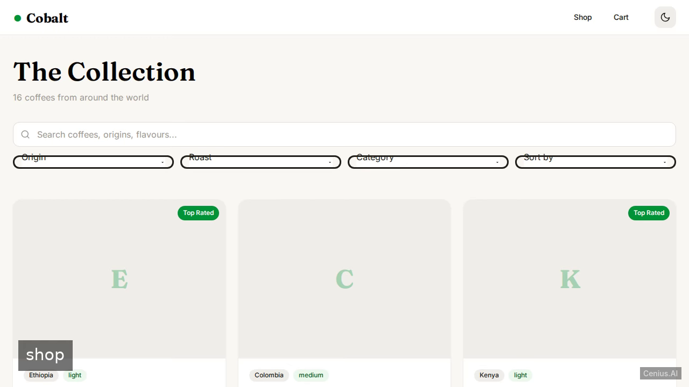
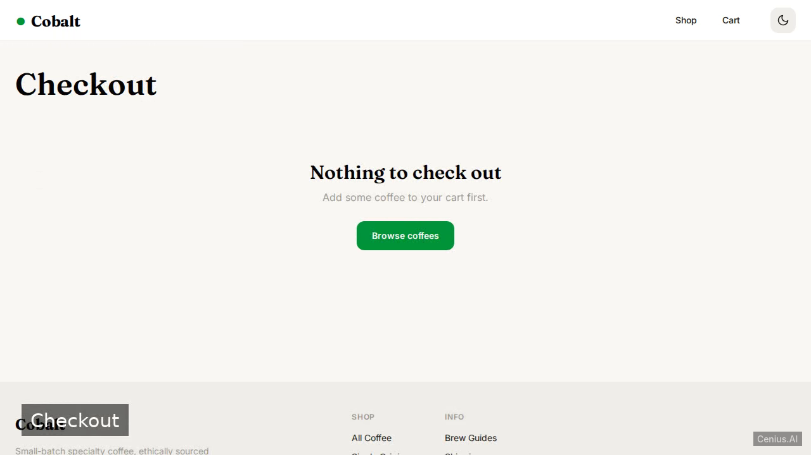

# Cobalt - Coffee Roaster Storefront — Full-stack app e-commerce storefront reference implementation

**Cobalt - Coffee Roaster Storefront** is a free, open-source e-commerce storefront written in Full-stack app. A modern Angular e-commerce storefront for a coffee roaster, enabling customers to browse, filter, and purchase coffee products with a polished, responsive UI and seamless light/dark theme switching. Every Cobalt - Coffee Roaster Storefront file — code, design, seeded demo data — ships in this repository under the Apache-2.0 license. Self-host it, or [remix Cobalt - Coffee Roaster Storefront on cenius.ai](https://cenius.ai/marketplace/p/cobalt---coffee-roaster-storefront?ref=gh&utm_campaign=cobalt-coffee-roaster-storefront-webapp) to get a custom build with full rebrand rights.


[](LICENSE)  [](https://cenius.ai)

[](https://cenius.ai/marketplace/p/cobalt---coffee-roaster-storefront?ref=gh&utm_campaign=cobalt-coffee-roaster-storefront-webapp)

> **▶ [Open & edit in cenius.ai](https://cenius.ai/marketplace/p/cobalt---coffee-roaster-storefront?ref=gh&utm_campaign=cobalt-coffee-roaster-storefront-webapp)** — one click to an editable workspace: describe changes in plain English, get an instant preview, one-click deploy and host. Modifications made on the platform come with full rebrand & relicense rights.

_Local clone? See [Quick start](#quick-start) below. cenius.ai is the zero-setup path._

## Demo



📽 **[Demo video on cenius.ai](https://cenius.ai/marketplace/p/cobalt---coffee-roaster-storefront?ref=gh&utm_campaign=cobalt-coffee-roaster-storefront-webapp)** — the complete run-through · [MP4](.github/media/demo.mp4)

## Screenshots

  

## Architecture

No external services required: the entire e-commerce storefront runs from this Full-stack app repo (34 files). Top-level layout: `src/`. `./install.sh` gets you from a fresh clone to a running instance with sample data in a single step. For environment-specific setup, see [`INSTALL.md`](INSTALL.md).

## Features

- Product listing with filtering and sorting
- Product detail view
- Shopping cart
- Checkout process
- Theme toggle (light/dark mode)
- Responsive design
- Seeded demo data

## Quick start

```bash
./install.sh   # installs dependencies + seeds demo data
```

See [`INSTALL.md`](INSTALL.md) for full setup and usage instructions.

## Usage guide

### Overview

Cobalt — a coffee roaster e-commerce storefront

### Quickstart

After completing the install steps in `INSTALL.md`:

```bash
npm run dev    # start the server
## in another terminal:
curl http://localhost:8000/
```

### Endpoints

_No HTTP routes were auto-extracted. If the server registers routes dynamically (e.g. config-driven), document them here manually._

### Worked example

1. Boot the server (`npm run dev`).
2. Hit a smoke-test endpoint:

```bash
curl -sS http://localhost:8000/
```

3. If you get a JSON / HTML response, the server is healthy. Inspect `.env` if it errors with an auth/config failure.

### Reference

#### Entry points

_No explicit entry points declared in this project's manifests._

### Next steps

- Read [INSTALL.md](./INSTALL.md) if anything in the Quickstart didn't work.
- Inspect `.env.example` for the full list of environment variables this project understands.
- See [README.md](./README.md) for the architecture diagram + feature list.

_Full guide: [`USAGE.md`](USAGE.md)_

## FAQ

### What's the quickest way to self-host Cobalt - Coffee Roaster Storefront?

Clone this repository and run `./install.sh`, then start the app as described in [`INSTALL.md`](INSTALL.md). Cobalt - Coffee Roaster Storefront is fully self-hostable — no external services are required to try it.

### How is Cobalt - Coffee Roaster Storefront built technically?

Full-stack app end-to-end. Every file you need to run the app is here in this repository — code, configuration, seed data. Highlights include theme toggle (light/dark mode).

### How do I customise Cobalt - Coffee Roaster Storefront's branding?

Yes. The MIT license lets you remove the original branding and ship under your own name. For a guided approach, [remix it on cenius.ai](https://cenius.ai/marketplace/p/cobalt---coffee-roaster-storefront?ref=gh&utm_campaign=cobalt-coffee-roaster-storefront-webapp): you get a fresh build with full rebrand and relicense rights.

### Does the Cobalt - Coffee Roaster Storefront license allow commercial use?

Yes — it ships under the Apache-2.0 license, which permits commercial use, modification and redistribution. The full text is in [LICENSE](LICENSE).

### Is Cobalt - Coffee Roaster Storefront editable without a developer?

Non-developers can use [cenius.ai](https://cenius.ai/marketplace/p/cobalt---coffee-roaster-storefront?ref=gh&utm_campaign=cobalt-coffee-roaster-storefront-webapp) to make changes. Describe your goal in everyday language and the platform delivers an updated, ready-to-run project — zero coding on your part.

## License & rebranding

Released under the [Apache License 2.0](LICENSE) (© 2026 Cenius AI) — free for personal and commercial use. The Cenius name/logo are trademarks (see NOTICE).

**Need a customized version?** [Remix this app on cenius.ai](https://cenius.ai/marketplace/p/cobalt---coffee-roaster-storefront?ref=gh&utm_campaign=cobalt-coffee-roaster-storefront-webapp) — modifications made on the platform come with **full rebrand & relicense rights** over your derivative.

## Built with cenius.ai

This entire application — code, design, seeded demo data — was generated on **[cenius.ai](https://cenius.ai)** from a plain-English description.

- 🚀 [Build your own app on cenius.ai](https://cenius.ai)
- 🎛️ [Remix Cobalt - Coffee Roaster Storefront on the marketplace](https://cenius.ai/marketplace/p/cobalt---coffee-roaster-storefront?ref=gh&utm_campaign=cobalt-coffee-roaster-storefront-webapp) — open it in a workspace, prompt for changes, and ship your own version.

More open-source apps: [the Cenius-ai catalog](https://github.com/Cenius-ai) · [showcase index](https://github.com/Cenius-ai/showcase)
